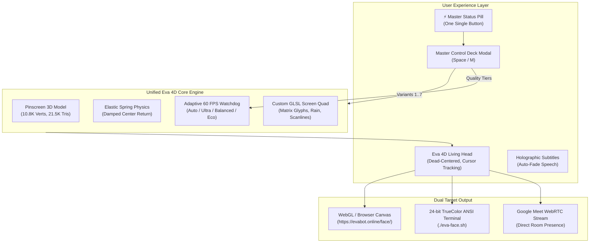

# ⚡ EVA 4D MATRIX FACE — Universal Neural 3D Avatar

[](LICENSE)
[](#-adaptive-60-fps-engine)
[](#-dual-platform-parity-web--terminal)
[](#-google-meet--webrtc-streaming)
[](tsconfig.json)

**EVA 4D** is an ultra-minimalist, high-performance **Universal 4D Matrix Neural Head**. It runs identically across modern Web browsers (WebGL 2 / Three.js) and Linux SSH terminal consoles (differential 24-bit TrueColor ANSI rasterization), dead-centered with organic breathing, cursor/touch gaze tracking, damped elastic spring-return physics, Web Audio voice animation, and Google Meet streaming.

---

## 🌟 Key Features

1. **Single-Page Minimalist UX (Zero Clutter)**
   - When idle, the viewport contains zero distractions: only the mathematically centered 4D living matrix head of Eva and falling code streams.
   - A single sleek floating cyber-pill at top (`[ ⚡ EVA 4D // PHOSPHOR · 60 FPS · ⚙️ УПРАВЛЕНИЕ ]`) opens the **Master Control Deck Modal** (`[Space]` or `[M]`).
   - Holographic subtitles auto-appear when Eva speaks or listens, and smoothly dissolve when idle.

2. **7 Authentic 4D Matrix States of Eva**
   - **`[1] Phosphor Green`**: Authentic 520nm emerald phosphor glow, Katakana matrix code streams.
   - **`[2] Vector Hologram`**: Zero-cost vector scanlines running at strict 60 FPS on any hardware (Eco mode).
   - **`[3] Electra Cyan`**: High-voltage electric cyan `#00f0ff` in deep obsidian cybernetic space.
   - **`[4] Solar Amber`**: Cyber gold `#ffb400` with dark bronze shadows and warm matrix energy.
   - **`[5] Rain Cascade`**: Dense torrential digital rain, with Eva's facial features materializing directly from the waterfall.
   - **`[6] Solid HD Blocks`**: High-contrast subpixel TrueColor half-blocks (`▀`), sculptural depth contours.
   - **`[7] Cyber Wireframe`**: Digital polygon contour lines and neural net mesh wireframe.

3. **Guaranteed 60 FPS Adaptive Engine**
   - Built-in real-time FPS watchdog automatically modulates shader complexity.
   - Four distinct tiers: `AUTO 60 FPS`, `ULTRA` (full glyph atlas & 2-layer rain), `BALANCED` (optimized sampling), and `ECO` (pure vector scanlines without texture fetch latency).

4. **Dual Platform Parity: Web & Linux Terminal**
   - **Web**: Custom GLSL post-processing shaders, WebGL render target, Web Audio procedural SFX, speech synthesis & recognition.
   - **Linux Terminal / SSH**: Direct triangle rasterizer of high-fidelity 3D mesh (10.8K vertices, 21.5K triangles), 24-bit TrueColor ANSI output, full mouse gaze tracking via SGR 1006 protocol, elastic spring return, and in-console menu overlay (`[m]`).

5. **Voice Dialogue & Google Meet Presence**
   - Real-time speech synthesis and speech recognition (Russian & English).
   - Audio FFT analysis animating Eva's mouth deformation and phosphor luminance in real time.
   - Direct connection and streaming launcher for Google Meet sessions.

---

## 🌀 7 4D Matrix States Overview

| # | Variant | Key | Primary Color | Visual Style |
|---|---|---|---|---|
| **1** | **PHOSPHOR GREEN** | `[1]` | `#00ff66` (520nm) | Authentic Matrix Phosphor, Katakana glyph atlas |
| **2** | **VECTOR HOLOGRAM** | `[2]` | `#00ffbe` | Vector laser scanlines, zero-overhead 60 FPS |
| **3** | **ELECTRA CYAN** | `[3]` | `#00f0ff` | High-voltage neon cyan, supernova highlights |
| **4** | **SOLAR AMBER** | `[4]` | `#ffb400` | Cyber gold & amber, bronze shadows |
| **5** | **RAIN CASCADE** | `[5]` | `#10ff40` | Heavy falling rain streams, emerging face |
| **6** | **SOLID HD BLOCKS** | `[6]` | `#00ff8c` | Subpixel TrueColor half-blocks (`▀`), sharp depth |
| **7** | **CYBER WIREFRAME** | `[7]` | `#3cd2ff` | Digital contour lines & polygonal neural net |

---

## 🚀 Quick Start

### 1. Web Version
```bash
# Clone the repository
git clone https://github.com/evaline-online/eva-face.git
cd eva-face

# Install dependencies
npm install

# Build browser bundle (esbuild)
npm run build:browser

# Start local dev server
npm run dev:browser
# -> http://127.0.0.1:8080 or port 8093
```
Production URL: **[https://evabot.online/face/](https://evabot.online/face/)**

### 2. Linux Terminal / SSH Console
```bash
# Launch Eva in terminal
npm start
# or via launcher
./eva-face.sh

# Launch specific 4D states directly in terminal:
./eva-face.sh phosphor
./eva-face.sh hologram
./eva-face.sh electra
./eva-face.sh solar
./eva-face.sh cascade
./eva-face.sh solid
./eva-face.sh wireframe
```

---

## ⌨️ Keyboard & Mouse Controls

| Input | Action | Function |
|---|---|---|
| **Mouse / Touch Drag** | Rotate & Look | Rotates Eva in 3D; automatically springs back to dead center upon release |
| **Mouse Hover** | Continuous Gaze | Face subtly tracks cursor / finger gaze with organic micro-breathing |
| **`[Space]`** or **`[M]`** | Master Deck | Toggles the Master Control Deck modal on/off |
| **`[1]` .. `[7]`** | 4D Variants | Instantly switches between Eva's 7 matrix states |
| **`[Q]`** | 60 FPS Quality | Cycles through `AUTO` → `ULTRA` → `BALANCED` → `ECO` |
| **`[R]`** | Recenter Face | Instantly resets all rotation angles to 100% dead-center |
| **`[F]`** | Fullscreen | Toggles immersive fullscreen mode |
| **`[S]`** | Ask Eva | Triggers voice speech synthesis dialogue |
| **`[Esc]`** | Close Modal | Closes the Master Deck overlay |

---

## 📁 Repository Structure

```
eva-face/
├── index.html                  # Minimalist single-page application & Master Deck modal
├── src/
│   ├── browser.ts              # Web entrypoint, UI bindings, Web Audio procedural SFX
│   ├── matrix_face.ts          # Core 3D engine, custom GLSL shaders, spring physics
│   ├── terminal.ts             # High-performance 3D ANSI console rasterizer (SGR mouse)
│   ├── headmodel.ts            # Studio-grade 3D Pinscreen facial geometry buffers
│   └── heads/                  # Modular head architecture & independent station modules
│       ├── eva_matrix.ts       # Eva Phosphor module
│       ├── hologram_eco.ts     # Vector Hologram Eco 60 FPS module
│       ├── neo_electra.ts      # Electra Cyan module
│       ├── adam_cyber.ts       # Solar Amber module
│       ├── rain_code.ts        # Rain Cascade module
│       ├── solid_hd.ts         # TrueColor Solid Blocks module
│       └── ascii_classic.ts    # Retro ASCII Stencil module
├── stations/                   # Standalone URLs for each modular head station (/face/stations/)
├── dist/
│   └── face.js                 # Compiled & minified browser bundle (1.3MB with Three.js)
├── tools/
│   ├── capture_eva4d.mjs       # Headless CDP automated screenshot capture & QA suite
│   └── cdp_bench.mjs           # Performance benchmark suite
└── eva-face.sh                 # Master launcher script for terminal & web stations
```

---

## 🏗️ Architecture



---

## 📄 License

MIT License © 2026 [evaline-online](https://github.com/evaline-online). Built for EvaBot Neural Platform.
